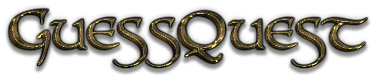
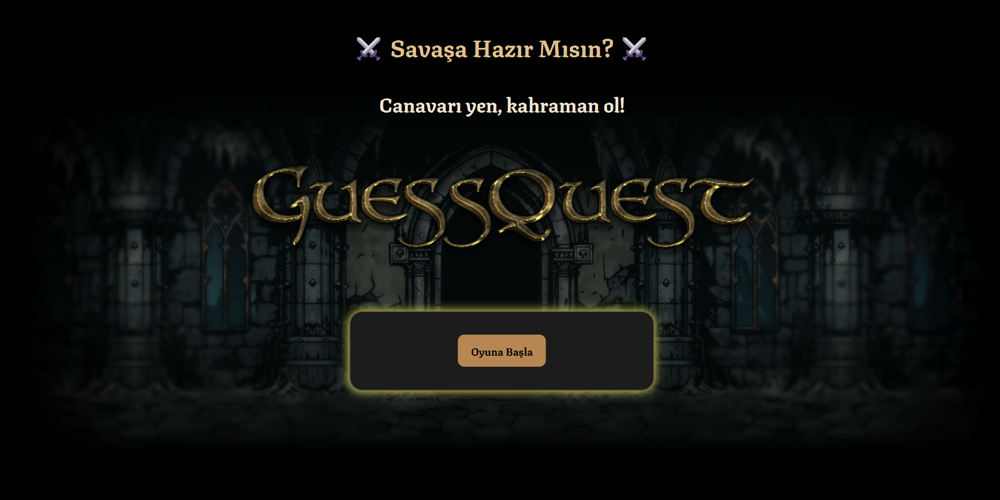
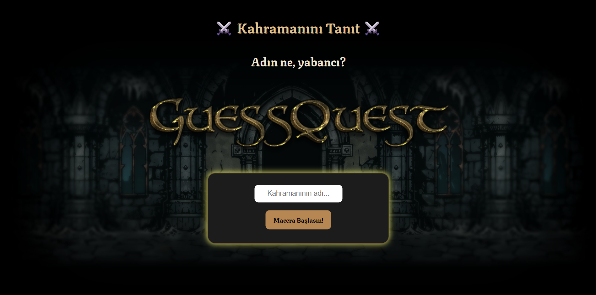
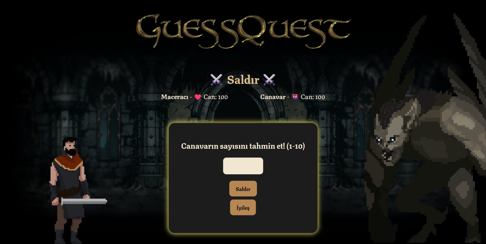
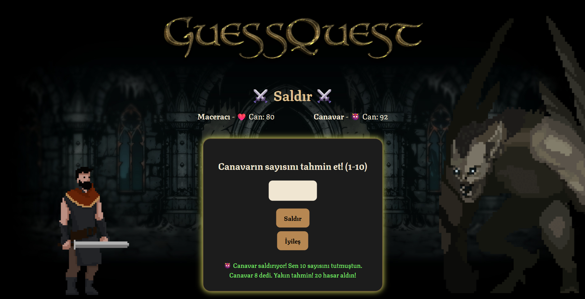
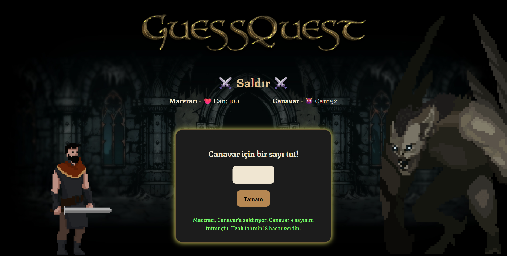
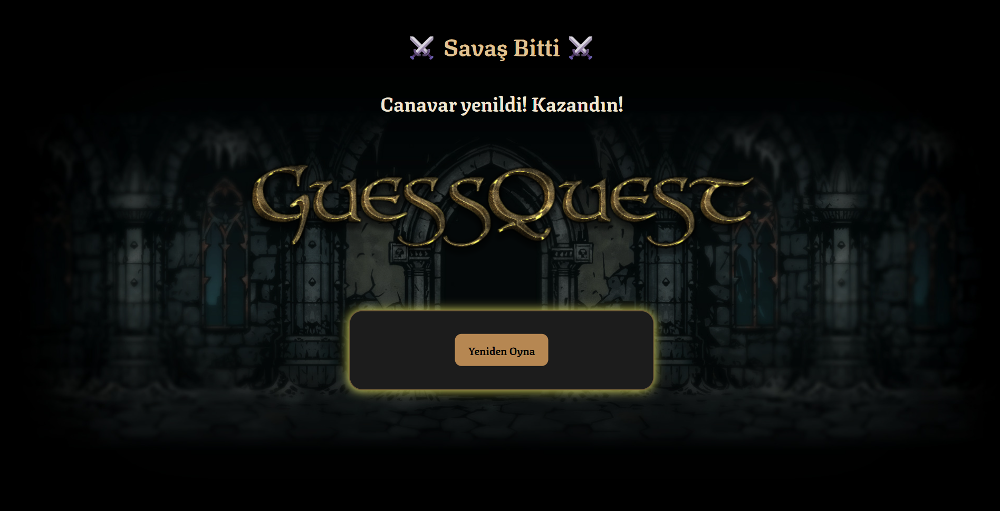

# GuessQuest-Showcase

A prediction-based war game built with Ruby. (Demo & Screenshots only)

# GuessQuest

🎯 A prediction-based war game built with Ruby.
Ruby Gems used - Sinatra, webrick, Rails, bundler

> This is a **showcase repo**. The source code is private.

## 🎮 Game Overview

GuessQuest is a war-themed strategy game where the player must predict the enemy's moves. It blends chance and logic in an engaging way.

## 📸 Screenshots

---

© 2025 GuessQuest by Sue26al. Source code is private.
